# Sistema de Gestión de Proyectos de Investigación

Este proyecto es una aplicación web desarrollada con React, Material UI, Cloudinary y Firebase, diseñada para la gestión integral de proyectos de investigación académica. Permite a docentes, coordinadores(gestionar usuarios) y estudiantes registrar, visualizar, editar y administrar proyectos, así como añadir avances de los mismos.

---

## 🚀 Características principales

- **Registro y edición de proyectos:**  
  Permite crear nuevos proyectos, agregar objetivos, integrantes, fechas, presupuesto, institución y observaciones.

  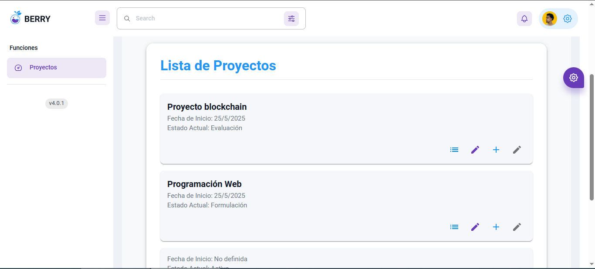
  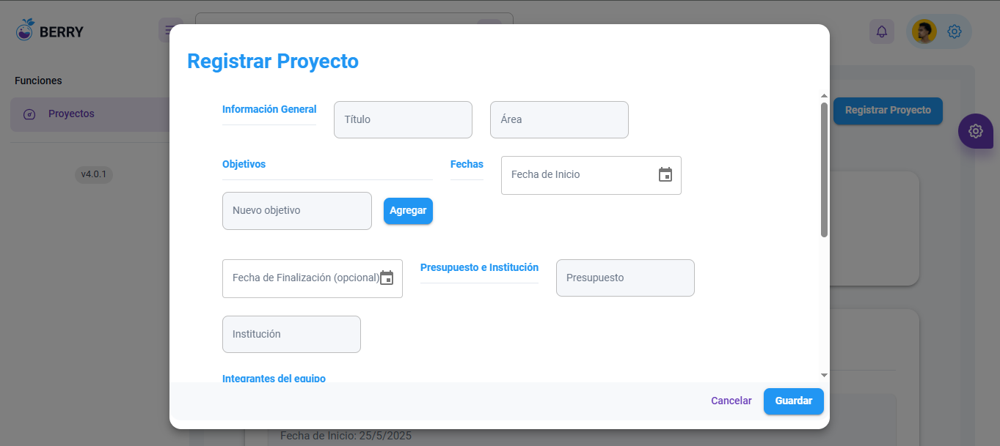
  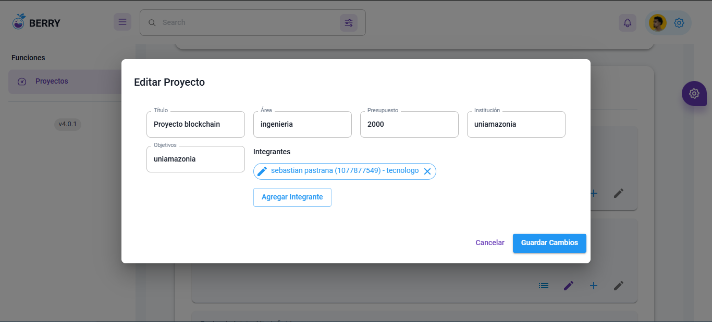
  

- **Gestión de usuarios:**  
  Los coordinadores pueden crear, editar y eliminar usuarios del sistema.
  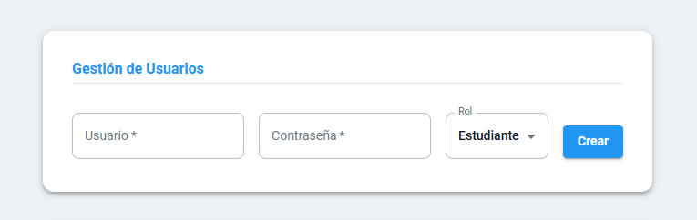
  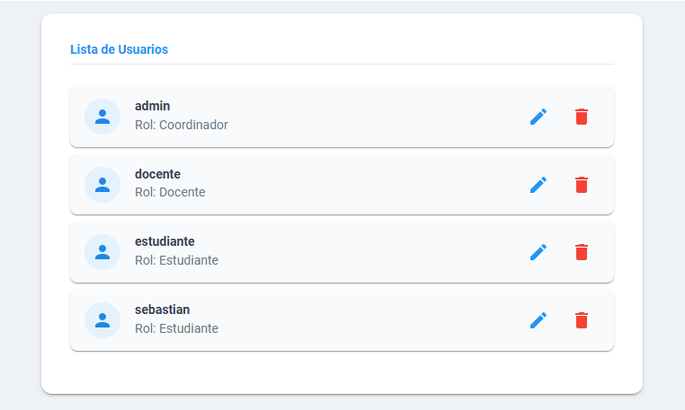
  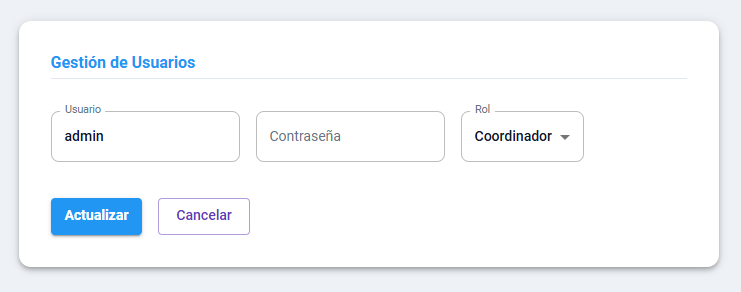


- **Control de estados:**  
  Los proyectos pueden cambiar de estado (Formulación, Evaluación, Activo, Inactivo, Finalizado) y se mantiene un historial de cambios.

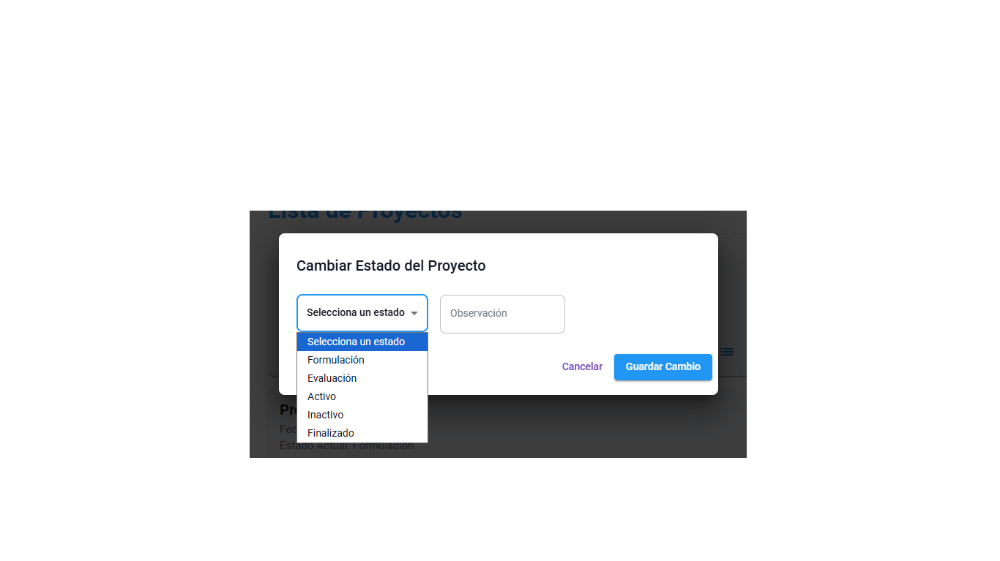
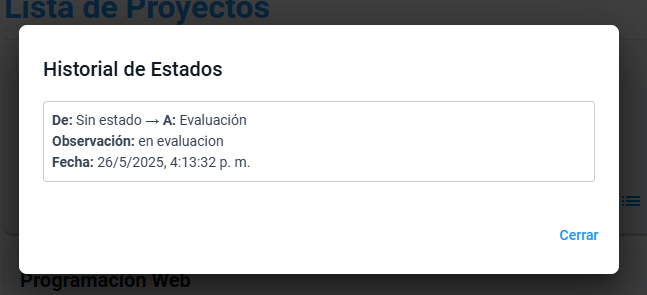


- **Gestión de avances:**  
  Se pueden registrar avances de los proyectos, incluyendo la subida de archivos (imágenes, PDF, Word).

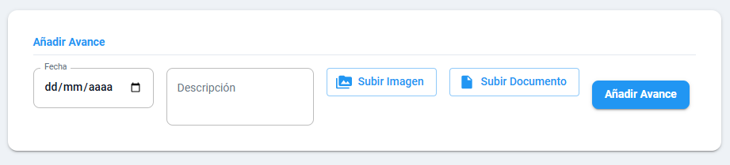
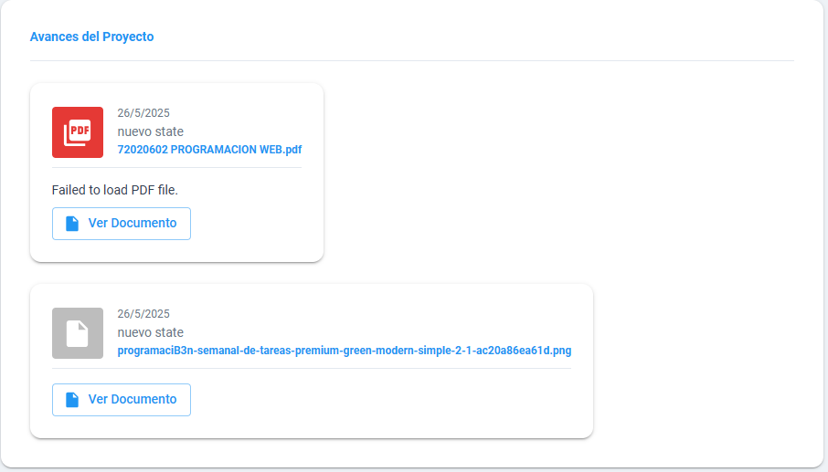


- **Filtros y búsqueda:**  
  Listados de proyectos con filtros por título, institución, área y docente.

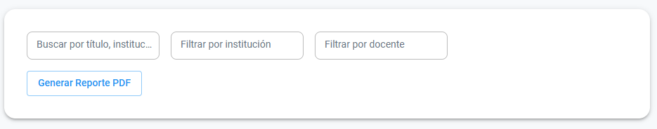

- **Exportación de reportes:**  
  Generación de reportes en PDF de los proyectos registrados.

- **Autenticación:**  
  Inicio de sesión tradicional y con Google.

  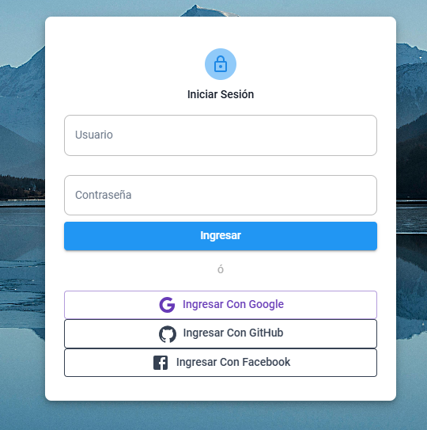

---

## 🗂️ Estructura del proyecto

```
src/
  ├── api/
  ├── assets/
  ├── bd/
  ├── components/
  ├── contexts/
  ├── hooks/
  ├── layout/
  ├── themes/
  ├── views/
  │    ├── Home/
  │    ├── Login/
  │    ├── admin/
  │    └── projects/
  ├── App.jsx
  └── index.jsx
```

---

## ⚙️ Instalación

1. **Clona el repositorio:**
   ```sh
   git clone https://github.com/joanbest/FinalWeb.git
   cd <nombre-del-proyecto>
   ```

2. **Instala las dependencias:**
   ```sh
   npm i
   ```

3. **Configura las variables de entorno:**  
   Crea un archivo `.env` en la raíz del proyecto y agrega tus credenciales de Firebase, Cloudinary y la URL de la API backend. Ejemplo:
   ```
   VITE_API_URL=https://backusuarios-production.up.railway.app
   CLOUDINARY_CLOUD_NAME=...
   CLOUDINARY_API_KEY=...
   CLOUDINARY_API_SECRET=...
   ```

---

## 🖥️ Scripts disponibles

- `npm start`  
  Inicia la aplicación en modo desarrollo.

- `npm build`  
  Genera la versión de producción.

- `npm test`  
  Ejecuta los tests.

---

## 🛠️ Tecnologías utilizadas

- **React**  
- **Material UI**  
- **Firebase (Firestore)**
- **Cloudinary**  
- **Vite**  
- **Axios**  
- **jsPDF**  
- **React Router Dom**  

---

## 👥 Roles y permisos

- **Docente:**  
  Puede registrar y gestionar sus propios proyectos.

- **Coordinador:**  
  Administra usuarios y tiene acceso a todos los proyectos.

- **Estudiante:**  
  Visualiza y agrega avances a los proyectos en los que participa.

---

## 🤝 Contribución

1. Haz un fork del repositorio.
2. Crea una rama para tu feature (`git checkout -b feature/nueva-funcionalidad`).
3. Realiza tus cambios y haz commit (`git commit -am 'Agrega nueva funcionalidad'`).
4. Haz push a tu rama (`git push origin feature/nueva-funcionalidad`).
5. Abre un Pull Request.

---

## 📄 Licencia

Este proyecto está bajo la licencia MIT.

---

> Para dudas o sugerencias, contactanos

